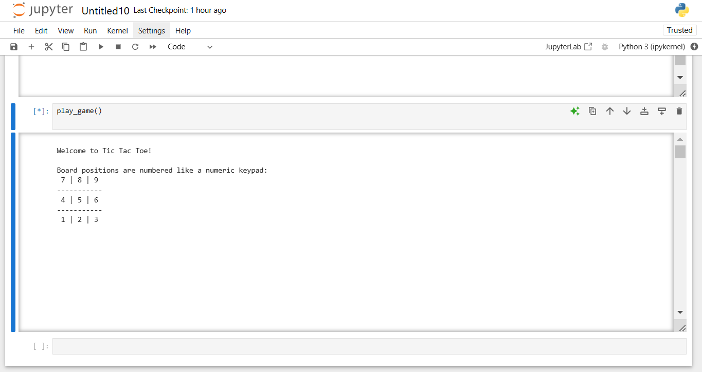
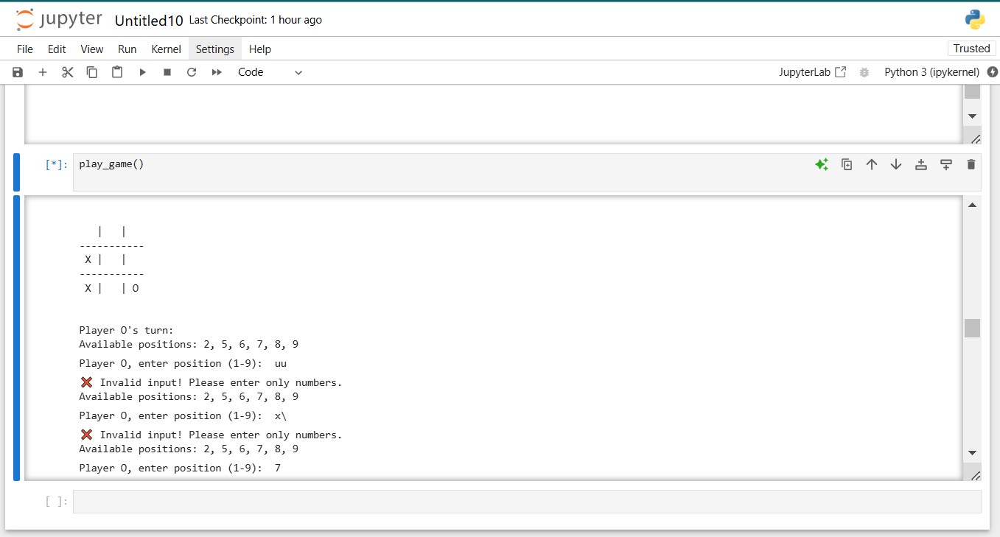
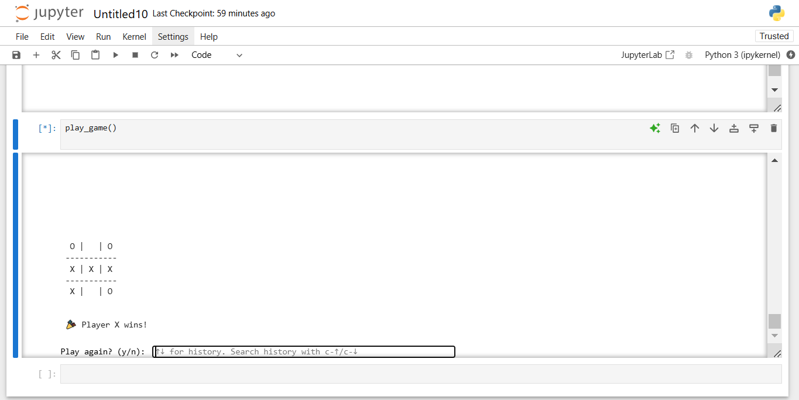

# tic-tac-toe-game
 
 This is my first python project:

description: A command-line implementation of the classic Tic Tac Toe game with input validation and testing.


## Features

- 🎮 Two-player gameplay
- 🛡️ Input validation and security
- ✨ Clean code with type hints
- 🧪 Comprehensive testing

## Game Preview

### Starting a New Game


### Gameplay in Action


### Winning Screen


## How to Play

The board positions are mapped like a numeric keypad:
```
 7 | 8 | 9 
-----------
 4 | 5 | 6 
-----------
 1 | 2 | 3 
```

## Installation

1. Ensure Python is installed
2. Clone this repository:
```bash
git clone https://github.com/danieshirak/tic-tac-toe.git
```
3. Navigate to the project directory:
```bash
cd tic-tac-toe
```
4. Run the game:
```bash
python src/game.py
```

## Project Structure
```
tic-tac-toe/
├── src/
│   └── game.py        # Main game logic
├── tests/
│   └── test_game.py   # Test suite
└── screenshots/       # Game previews
```

## Testing

1. Make sure you're in the project directory:
```bash
cd tic-tac-toe
```

2. Run the tests:
```bash
python -m unittest tests/test_game.py
```

All tests should pass, verifying:
- Game initialization
- Win detection
- Input validation
- Game state tracking